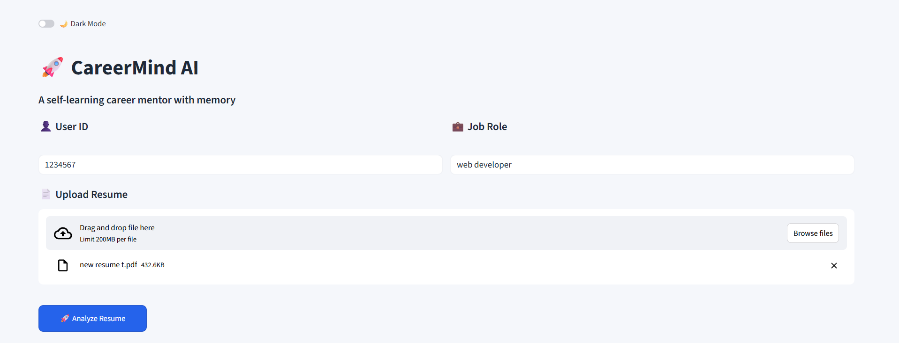
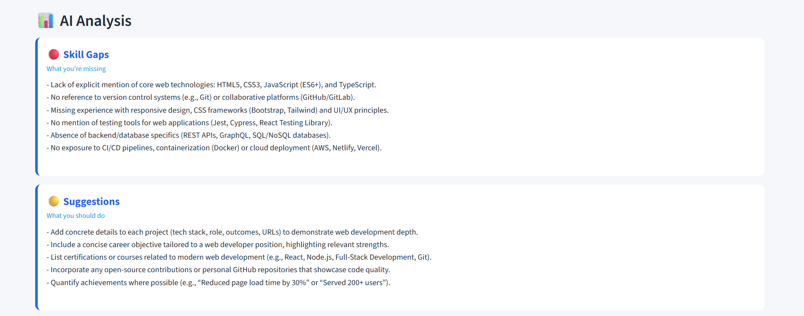
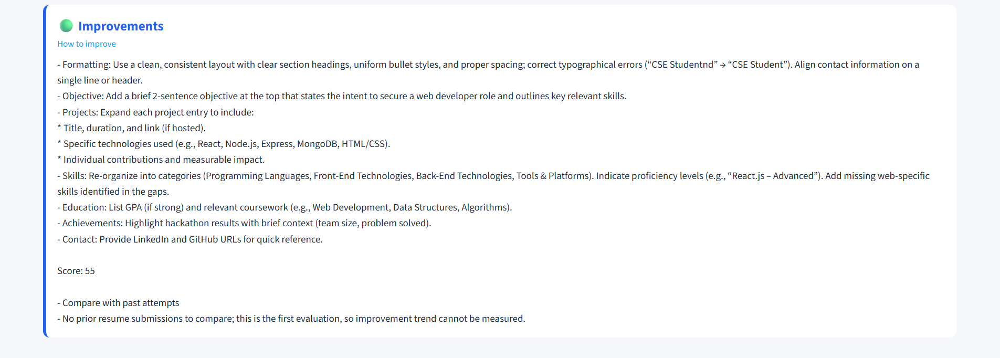
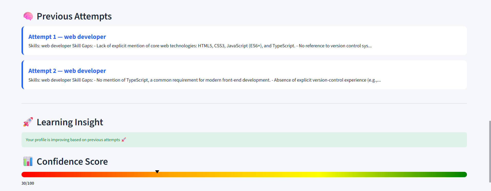

# 🚀 Career Mentor AI

An AI-powered resume analyzer that provides personalized feedback, identifies skill gaps, and suggests improvements based on job roles.

## Features

- 📄 Resume analysis based on job role
- 🧠 AI-generated skill gap detection
- 📈 Confidence score (0–100)
- 🔁 Tracks multiple attempts
- 📊 Shows improvement over time


## Why This Project?

Most resume tools give generic feedback.

Career Mentor AI goes beyond that:
- Understands job-specific requirements
- Identifies *actual skill gaps*
- Tracks improvement across multiple attempts
- Gives a confidence score to measure readiness

👉 It acts like a personalized AI career coach, not just a resume checker.


## Tech Stack

- Python
- Streamlit
- Groq API (LLM)
- dotenv (secure API handling)


## How to Run

```bash
git clone https://github.com/tanushreebrao/career-mentor-ai.git
cd career-mentor-ai
pip install -r requirements.txt
streamlit run app.py
```


## Environment Setup

Create a `.env` file in the root folder and add your API key

```bash
GROQ_API_KEY=your_api_key_here
```

## 🧠 How It Works

1. User uploads resume
2. Text is extracted using parser
3. Prompt sent to Groq LLM
4. AI analyzes and returns:
   - Skill gaps
   - Suggestions
   - Improvements
   - Confidence score
5. Memory tracks past attempts

   
## Screenshots

### 🔹 Input Screen


 ### 🔹 AI Analysis Output


### 🔹 Improvements


### 🔹 Confidence Score



## Future Improvements

- Add real-time job scraping (LinkedIn / Indeed)
- Improve memory using vector databases (Hindsight integration)
- Add user login & profile tracking
- Deploy as a full web application
  

## Author

**Tanushree B Rao**  
Built for Hackathon 
Passionate about AI, problem-solving, and building impactful tools
